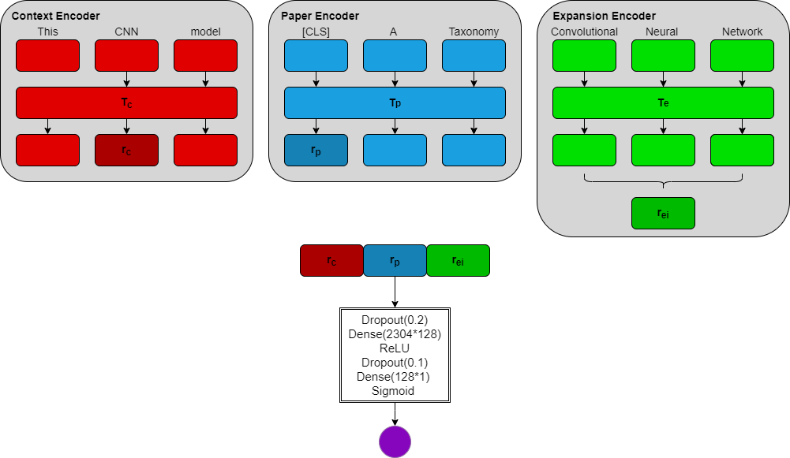

# STARDUST: **S**cientific **T**ext **A**c**R**onym **D**isambiguation **US**ing **T**riEncoder

This is the codebase for the paper an Investigation of Sense Disambiguation in Scientific Texts.



Our tri encoder model consists of 3 independent transformer encoders: (1) a context encoder, which represents the target acronym and its surrounding context, (2) a paper encoder, which represents the paper a target sentence is from, and (3) an expansion encoder that embeds each expansion for an acronym. Each encoder is initalized with a pertrained model. We feed these embedding into an MLP classifier, which is trained while the encoders are kept frozen.

## Dependencies

All of the dependencies can be found in the `requirements.txt` file.

All of our datasets can be found in this [google drive folder](https://drive.google.com/drive/folders/1i9lhJCY_7DjgrB8XzLX8ecKT6X3qBCMP?usp=sharing).

If you would like to recreate them yourself, you will first need to get access to the S2ORC dataset. More information can be found [here](https://github.com/allenai/s2orc). Then, you will need to install ElasticSearch. Then, you can follow the steps in the following sections.

## Data

### SciAD

For our AD experiments, we the use the SciAD dataset. This is a dataset of sentences from scientific papers that contain acronyms. You can get a copy of this dataset from [here](https://github.com/amirveyseh/AAAI-21-SDU-shared-task-2-AD). The main files of interest are `train.json`, `dev.json`, and `diction.json`. However, for the sake of convenience, we convert the train and dev jsons into csv files. This can be done with the following command:

```bash
python sciad_data/convert_sciad_format.py
```

Additionally, there are some formatting oddities in the acronym expansions given by `diction.json`. So, we can clean those up using the following command:

```bash
python sciad_data/clean_expansions.py
```

Now, we need to match the sentences in this dataset to papers in the S2ORC dataset. To do this, first you need to extract the urls of the S2ORC dataset shards into two files `metadata_urls.txt` and `pdf_parse.txt`. Then, you can use the following command:

```bash
python indexing/process_all.py
```

However, since the S2ORC dataset is too large to store locally on most machines (over 800GB), we can't keep all of the different shards. The above command deletes them after it is searched. However, we stored information about which papers each example in the SciAD dataset belongs to. We can use that to download only the papers that we need, resulting in a much smaller set of papers. We then also find papers that are cited by or cite the papers that link to examples in the SciAD dataset and download those as well. We can do this using the following commands:

```bash
python indexing/collect_needed_paper_ids.py
python indexing/download_all_needed_papers.py
```

This takes about 5 days to run since we have to process a lot of data. We can then index the papers that we downloaded using the following command:

```bash
python indexing/add_papers_to_index.py
```

This takes about a day to process, so try to make sure your ElasticSearch instance doesn't get reset or else you will have to re-index.

If certain papers of interest are somehow missed, we can detect them using the following command:

```bash
python indexing/find_missing_ids.py
```

and then we can download them using the following command:

```bash
python indexing/add_missing_ids_to_index.py
```

In the end, we will have about 100GB of papers downloaded and put into our index.

To format the data for training and evaluation, we can next use the `sciad_data/create_input_data.py` script. This includes all of the necessary information for doing training and evaluation using different amounts of information from context enhacement and citation graph enhancement, as described in the paper. The general usage of this script is as follows:

```bash
python sciad_data/create_input_data.py \
    --input <path to dataset e.g. train.csv or dev.csv>
    --max_examples <number of additional examples to pull from papers; the paper used either 0 or 1>
    --levels <number of steps to take when traversing citation graph; paper used either 0 or 1>
```

The output of this step can then be used in training/evaluation as described below.

### Pseudowords WSD

In this section, I will describe the process for creating out pseudowords datasets. This requires having an index over S2ORC papers, as described in the previous section. However, it doesn't need to be the same set of papers. Any large corpus of papers will do, but for our experiments we used the same one as the SciAD dataset.

#### Collecting Terms

First, download the `categories.txt` file from the google drive link shared at the beginning and save it in the `wikipedia_parsing` directroy. This contains the names of the categories we will select terms from. Feel free to adjust this list as you see fit.

Now, to get the terms we will use to form pseudowords, we can use the following command:

```bash
python wikipedia_parsing/get_unambiguous_terms.py
```

#### Pseudoword Formation

Now, we can begin the process of combining our terms into pseudowords. The first step is to create vector representation for each of the unambiguous terms. We will need the path to the tsv file that was generated from the previous command. Then, we use the following command:

```bash
python pseudowords/embed_terms.py --terms <path to tsv of terms>
```

This will generate a `.npy` file containing the vector representations of the terms. We will use these to create the pseudowords. This is done using the following command:

```bash
python pseudowords/make_triplets.py \
    --file <path to .npy file> \
    --adjustment <float adjustment factor as described in paper> 
```

This will output a json file dictionary mapping the pseudowords to their senses. In order to figure out a good adjustment factor, we looked at the distribution of ambiguous terms. You can collect that information using the steps in the next section.

#### Sense Distribution Adjustment

To collect the ambiguous terms from the categories, we can use the following command:

```bash
python wikipedia_parsing/get_ambiguous_terms.py
```

The script `wikipedia_parsing/sense_frequency` can be used to plot the distribution of the number of senses for the ambiguous terms.

Now, we can plot the distribution of distances using the following command:

```bash
python wikipedia_parsing/create_sense_distribution.py \
    --expansions <path to json mapping words to senses> \
    --summaries <path to tsv file containing terms and definitions> \
    --output <path to output file> \
    --title <title of plot>
```

#### Dataset Creation

We can now finally create the dataset. To do so use the following command:

```bash
python pseudowords/create_dataset.py \
    --dictionary <path to json mapping pseudowords to senses> \
    --num_examples <number of examples to use per pseudoword>
```

We can then split the dataset into training and evaluation sets using the following command:

```bash
python pseudowords/split_dataset.py \
    --directory <path to json mapping pseudowords to senses> \
    --dataset <path to dataset (created in previous step)> \
    --seed <random seed>
```

This will split the dataset according to the scheme shown in the following figure:


## Training and Evaluation

### SciAD

To train and evaluate our models on the SciAD dataset, follow the following steps.

First, we can precompute the embeddings for each of the acronym expansions in the dataset since these representation don't get updated during training. We can do this using the following command:

```bash
python sciad_data/create_expansion_embeddings.py \
    --dictionary <path to json mapping acronyms to expansions> \
    --device <device to use> \
    --model <path to model to use> \
    --mode <mode for pooling embeddings; default average over all tokens>
    --normalize <flag to normalize embedding vectors>
```

This command will create a `.npy` file containing the embeddings for each expansion. Now, with the datasets we created in prior section, we can beginning training and evaluation.

For training the AD model, we can use the following command:

```bash
python train_ad.py \
    --file <path to train csv file> \
    -levels <levels argument used when making train csv> \
    --max_examples <max example argument used when making train csv> \
    --expansion_embeddings_path <precomputed embeddings for the expansions> \
    --model <path to model> \
    --graph_mode <Average for BiEncoder, PaperAverage for TriEncoder> \
    --embedding_mode acronym \
    --scoring_model MLPScoring \
    --batch_size 1 \
    --lr <learning rate> \
    --log_every <logging frequency> \
    --num_epochs 10 \
    --project acronym_disambiguation \
    --device <device to use> \
    --dictionary <path to dictionary mapping acronyms to expansions>
```

Then to evaluate the model, we can use the following command:

```bash
python eval_ad.py \
    --file <path to test csv file> \
    --levels <levels argument used when making test csv> \
    --max_examples <max example argument used when making test csv> \
    --expansion_embeddings_path <precomputed embeddings for the expansions> \
    --model <path to model> \
    --graph_mode <Average for BiEncoder, PaperAverage for TriEncoder> \
    --embedding_mode acronym \
    --scoring_model MLPScoring \
    --project acronym_disambiguation \
    --device <device to use> \
    --dictionary <path to dictionary mapping acronyms to expansions> \
    --saved_scoring_model <path to trained scoring model>
```

The evaluation script will also write to a log file in the `logs/` directory. This will contain all of the incorrect examples and their predicted expansions and a summary of the model's performance.

### Pseudowords WSD

To train and evaluate our models on the pseudowords dataset, we can use the following command:

```bash
python train_wsd.py \
    --file <path to train csv file> \
    --word_to_senses <path to pseudowords dictionary> \
    --sense_dictionary <path to tsv mapping senses to definitions> \
    --project pseudowords \
    --device <device to use> \
    --lr <learning rate> \
    --batch_size <batch size to use> \
    --log_every <logging frequency> \
    --num_epochs <number of epochs to train for> \
    --model_name <name of model to use> \
    --model_type <BEM or Stardust> \
    --freeze_context_encoder <Stardust only: flag to freeze context encoder> \
    --freeze_gloss_encoder  <Stardust only: flag to freeze gloss encoder> \
    --freeze_paper_encoder  <Stardust only: flag to freeze paper encoder>
```

Then, to evaluate our model, we can use the following command:

```bash
python eval_wsd.py \
    --file <path to test csv file> \
    --word_to_senses <path to pseudowords dictionary> \
    --sense_dictionary <path to tsv mapping senses to definitions> \
    --project pseudowords \
    --device <device to use> \
    --model_name <name of model to use> \
    --model_type <BEM or Stardust> \
    --model_ckpt <path to model checkpoint to use>
```

This will also output a log file similar to the AD model.

Note: Stardust doesn't currently support Context Enhancement and Citation Graph Enhancement. However, it does support mini-batch processing unlike the AD model, which only supports batch processing via gradient accumulation. However, this should be fixed soon.

## Contact
Please address any questions or comments about this codebase to manav.rathod@berkeley.edu.